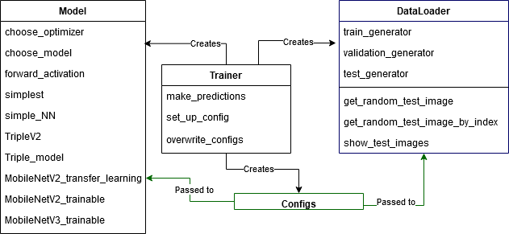

## FYS-STK3155/4155 Project 3

### Set-up

One needs to have following packages installed: `tensorflow`, `keras`, `wandb`. To install those run `pip install [nameofthepackage]`. In addition one needs to have a wandb account and log in by running `wandb login [apiloginnumber]`.

### Running
Once everything is installed and set-up correctly. To run the training:

```
python -w ignore 'train.py'
```

One can change the configurations in the `trainer.py` class. To change different model architectures, change the name of the model type in the configurations.

### Report folder
Contains Latex code and pdf of the report

### cnn folder
The main new library, see how it works together in the diagram:<br/>


### DataFiles folder
Contains the lego dataset downloaded from [Kaggle Lego](https://www.kaggle.com/joosthazelzet/lego-brick-images) and programatically separated into train, validation and test datasets.

### sweep_configs
Contains .yaml configuration files used to run tests on parameters for different neural networks.
